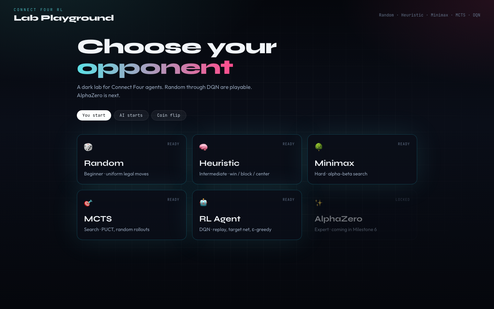
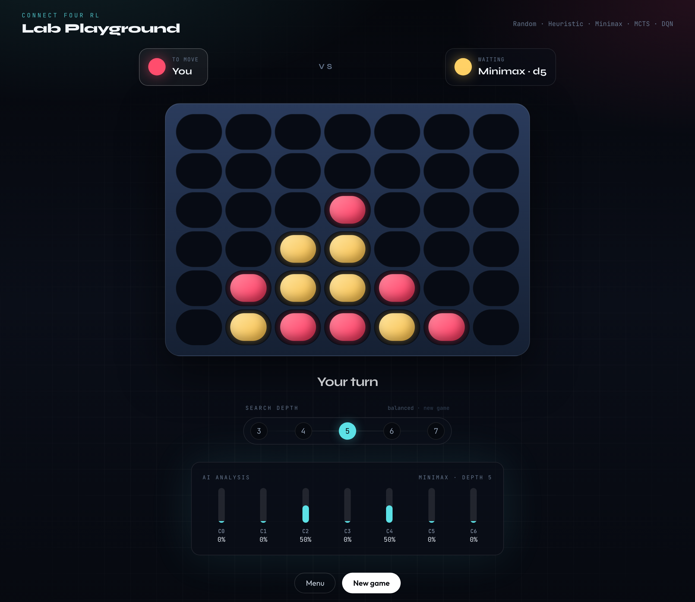

# Connect Four RL

I'm building Connect Four agents in order: random, heuristic, minimax, MCTS, DQN, then AlphaZero, and measuring what each idea actually buys.

The browser demo lets you play the same bots the benchmarks use. The work is the agents and the experiments.

**Playable now:** Random, Heuristic, Minimax, MCTS (uniform PUCT + random rollouts), DQN. AlphaZero is next.





## Play

Two terminals, from the repo root.

```bash
python3 -m venv .venv
source .venv/bin/activate
pip install -e ".[dev,rl]"
uvicorn backend.app.main:app --reload --port 8000
```

```bash
cd frontend
npm install
npm run dev
```

Open [http://localhost:5173](http://localhost:5173). Pick who starts, pick an opponent, click a column. Minimax has a depth control in-game; the bars under the board are that agent's analysis (softmax of scores or visit counts, not a sampling policy).

CLI still works:

```bash
python -m connect4.play --agent minimax
python -m connect4.play --agent mcts
python -m connect4.play --agent dqn
```

DQN needs a checkpoint at `models/dqn/dqn.pt` (gitignored):

```bash
python -m connect4.training.train_dqn --episodes 30000
```

Training and eval never go through HTTP. The FastAPI app is session glue for the demo.

## Agents

Every policy implements the same contract: `select_action(state, valid_actions) → AgentDecision`. The CLI, the HTTP layer, and the match harness all call that, then `env.step`.


| Agent         | Idea                                                                                                                                            |
| ------------- | ----------------------------------------------------------------------------------------------------------------------------------------------- |
| **Random**    | Uniform over legal columns.                                                                                                                     |
| **Heuristic** | No tree. Win, block, then score windows / center / forks. Instant-loss moves are hard-rejected.                                                 |
| **Minimax**   | Alpha-beta, center-first move order. Leaves use window/center features — not the full heuristic. Depth 2 is the first ply that can see a block. |
| **MCTS**      | PUCT with a uniform prior and random rollouts. Visit counts are the policy. No network yet.                                                     |
| **DQN**       | Small MLP, replay, target net, ε-greedy, illegal-action masking. Beats Random, loses to the tactician.                                          |


Connect Four with perfect play is a first-player win. None of these agents is a solver.

## Experiments

Same protocol unless noted: paired random openings, both seats, 4 opening plies. Full write-up, plots, and caveats: `[docs/report.md](docs/report.md)`.

### Minimax vs heuristic — can search beat a 1-ply tactician?

The heuristic still gets win / block / fork. Minimax's leaf does not. Depth 1 loses because it cannot see blocks. Depth 2 is the jump.

```bash
pip install -e ".[eval]"
python -m connect4.training.evaluate --opponent heuristic --games 200 --depths 1,2,3,4,5,6
```

200 games/depth:


| Depth | Win%      | Draw% | Nodes/move | Latency |
| ----- | --------- | ----- | ---------- | ------- |
| 1     | 14.5%     | 0.5%  | 7          | 1.3 ms  |
| 2     | 57.0%     | 6.5%  | 41         | 6.6 ms  |
| 3     | 58.5%     | 2.5%  | 159        | 23 ms   |
| 4     | 68.5%     | 6.5%  | 601        | 88 ms   |
| 5     | **79.0%** | 2.5%  | 2,022      | 268 ms  |
| 6     | 77.0%     | 4.5%  | 7,456      | 1029 ms |


Depth 5 is the practical agent. Depth 6 is slower and not stronger.

### Minimax vs Minimax(d=1) — same evaluator, only depth changes

Depth 1 vs itself is the control (50%). Everything above that is extra lookahead.

```bash
python -m connect4.training.evaluate --opponent d1 --games 100 --depths 1,2,3,4,5
```

100 games/depth:


| Depth | Win%  | Draw% | Nodes/move | Latency |
| ----- | ----- | ----- | ---------- | ------- |
| 1     | 50.0% | 0.0%  | 8          | 1.3 ms  |
| 2     | 87.0% | 3.0%  | 47         | 7.3 ms  |
| 3     | 88.0% | 1.0%  | 187        | 26 ms   |
| 4     | 90.0% | 2.0%  | 748        | 108 ms  |
| 5     | 91.0% | 1.0%  | 2,666      | 356 ms  |


Almost all of the lift is 1→2. Extra depth barely helps against a shallower copy of you; it still helps against the tactician.

### MCTS — PUCT + uniform prior + random rollouts

```bash
python -m connect4.training.evaluate_mcts --opponent heuristic --games 100 --sims 50,200,800
python -m connect4.training.evaluate_mcts --opponent minimax --minimax-depth 3 --games 100 --sims 50,200,800
```

100 games/budget:


| Sims | vs heuristic | vs Minimax d=3 | Latency |
| ---- | ------------ | -------------- | ------- |
| 50   | 9%           | 9%             | ~16 ms  |
| 200  | 36%          | 26%            | ~64 ms  |
| 800  | 64%          | 66%            | ~270 ms |


800 sims beat both, at about the same wall time as Minimax depth 5 — which is still 79% vs the heuristic. Extra rollouts help; a better leaf is the next lever.

### DQN — time-boxed value-based RL

Compact from-scratch DQN (no Stable-Baselines3). 40 games, greedy, after **30,000** self-play episodes. 3k comparison in parentheses.

```bash
python -m connect4.training.train_dqn --episodes 30000 --eval-games 40
```


| Opponent    | Win% | at 3k |
| ----------- | ---- | ----- |
| Random      | 80%  | 90%   |
| Minimax d=1 | 15%  | 10%   |
| Minimax d=2 | 5%   | 0%    |
| Heuristic   | 0%   | 2.5%  |


Beats Random. Does not beat a tactician. 10× episodes did not change that.

## Layout

```
connect4/env          rules (the MDP)
connect4/agents       policies
connect4/evaluation   match runner + metrics
connect4/training     experiment CLIs
backend/             FastAPI session glue — not used for training
frontend/             React demo
docs/report.md        full paper
```


## Next

AlphaZero-style policy/value + MCTS on this same engine and eval protocol. MCTS and DQN are frozen except for the hooks that work needs.

I used [Cursor](https://cursor.com) as a coding assistant, mainly for tests, the React demo, and APIs. The agents, the eval protocol, and the write-up in [`docs/report.md`](docs/report.md) are the part this repo is for.