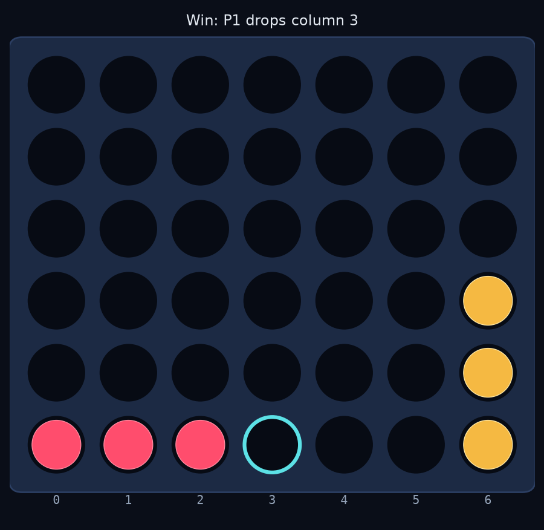
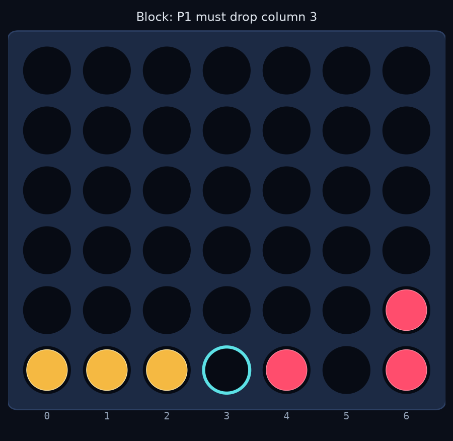
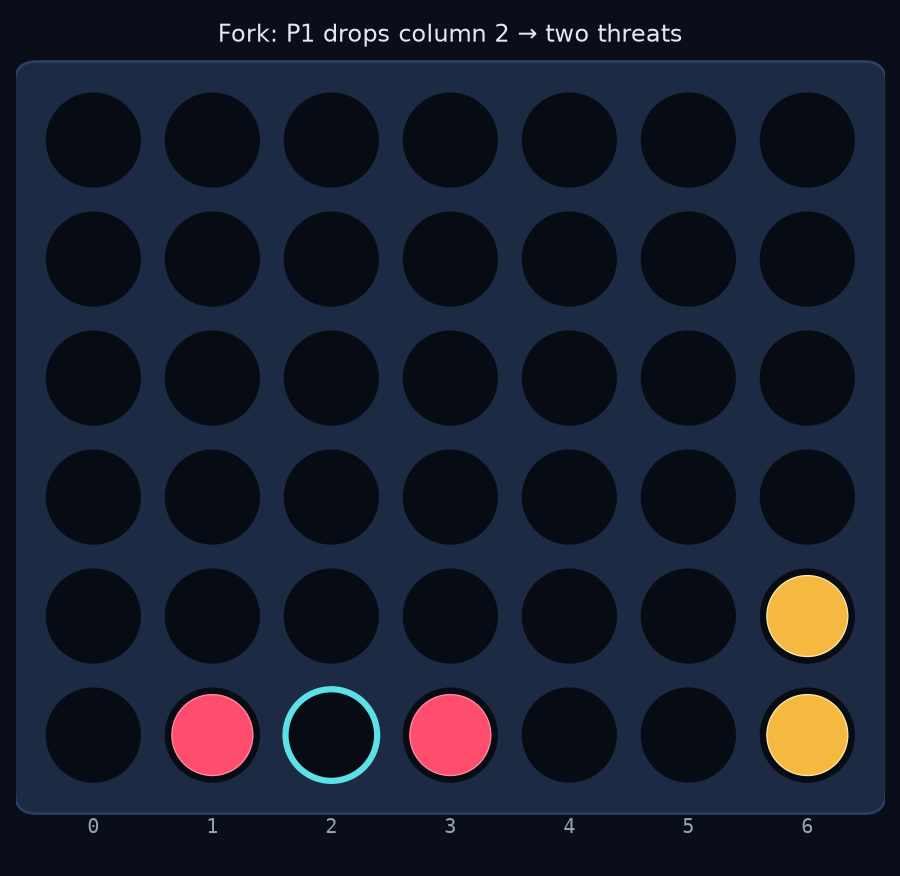
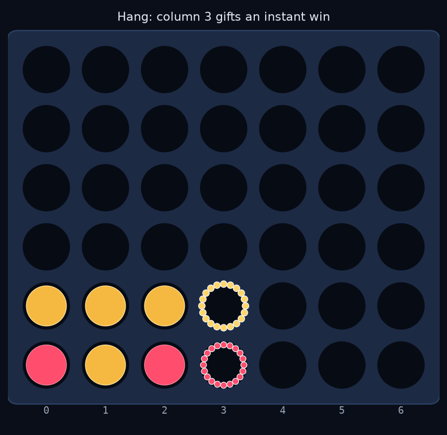
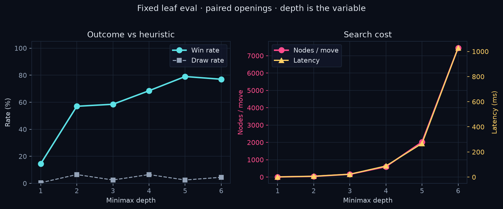
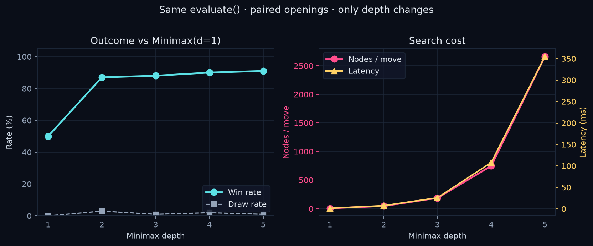
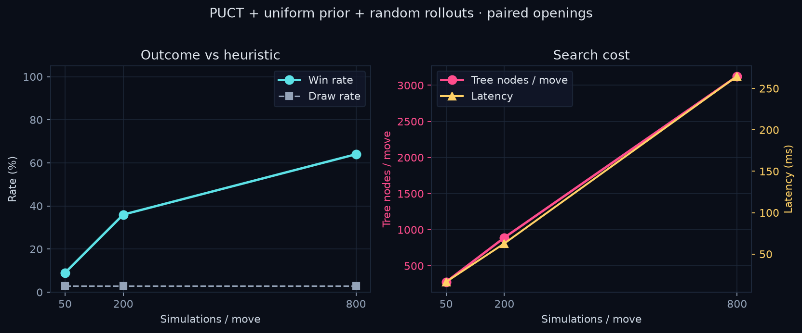
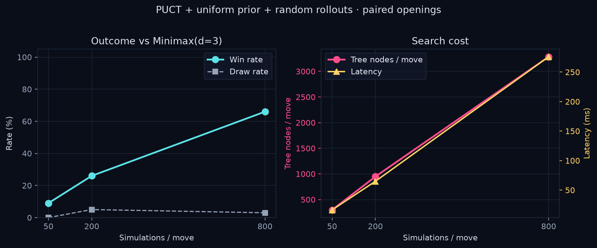

# Search, Tactics, and Deep RL in Connect Four

A sequence of agents from a 1-ply heuristic through alpha-beta and PUCT to from-scratch DQN, measured under a shared evaluation protocol.

Figures: [`experiments/results/`](../experiments/results/) (plots) and [`docs/figures/`](figures/) (tactic boards and demo). Tabular numbers are taken from the corresponding JSON, not re-typed.

---

## Abstract

This repository implements a progression of Connect Four agents and measures what each idea buys against a fixed protocol. The sequence is random play, a 1-ply tactical heuristic, depth-limited minimax with alpha-beta, Monte Carlo tree search with PUCT (uniform prior, random rollouts), and a compact from-scratch DQN. AlphaZero-style self-play is the remaining flagship and is not reported here.

Two minimax experiments separate *tactics* from *lookahead*. Against the full heuristic, depth 1 wins 14.5% of 200 games because it cannot see blocks; depth 2 jumps to 57%; depth 5 reaches 79% at ~268 ms/move; depth 6 is slower and not stronger. Against a copy of the same evaluator frozen at depth 1, the control is 50%, and almost all of the lift is again depth 1→2 (87%). Uniform-rollout MCTS beats the heuristic only at 800 simulations (~265 ms), where depth-5 minimax is still stronger. Compact DQN clearly beats random play and does not beat the heuristic; ten times more self-play episodes does not change that.

Connect Four with perfect play is a first-player win [Allis 1988]. None of these agents is a solver. The contribution is a defensible comparison of classical search and value-based deep RL on one environment, with the interactive demo using the same `select_action` contract as the benchmarks.

---

## 1. Introduction

The usual Connect Four demo ships one bot. This project ships a sequence, each step adding one idea, and asks a small enough experimental question that the answer can be wrong in public.

| Stage | Idea | Question |
|-------|------|----------|
| Random | Uniform legal moves | Baseline; action masking |
| Heuristic | 1-ply tactics, no tree | How far does handcrafted knowledge go? |
| Minimax / αβ | Explicit lookahead | What does depth buy, holding or not holding the leaf fixed? |
| MCTS / PUCT | Selective search | Can extra simulations replace a shallow evaluator? |
| DQN | Learned action values | Can Q-learning recover tactics from self-play? |
| AlphaZero | Policy/value + MCTS | Future work |

Training and evaluation import the Python package and call `env.step` in-process. They never go through HTTP. A FastAPI + React app exists so a reader can play the same agents; it is not a second implementation.

**Headline results**

- Minimax vs heuristic (200 games/depth): win rates 14.5%, 57.0%, 58.5%, 68.5%, **79.0%**, 77.0% at depths 1–6. Depth 5 is the practical agent (~268 ms/move).
- Minimax vs Minimax(d=1) (100 games/depth): 50%, 87%, 88%, 90%, 91%. The control is exact; almost all gain is 1→2.
- MCTS vs heuristic (100 games): 9% / 36% / 64% at 50 / 200 / 800 simulations (16 / 63 / 265 ms). At matched wall-clock, depth-5 minimax is still 79%.
- MCTS vs Minimax(d=3): 9% / 26% / 66%. Uniform-rollout MCTS beats depth 3 only at several times the latency.
- DQN (40 games, greedy): 80% vs random after 30k self-play episodes; 15% vs minimax d=1; 0% vs the heuristic. A 3k-episode checkpoint was 90% / 10% / 2.5% on the same protocol.


---

## 2. Environment

Standard 6×7 Connect Four (`connect4/env/`). Pieces are `0 / +1 / −1`. Row 0 is the **top**; gravity fills the highest empty index in a column. Actions are column indices `0..6`. Illegal actions raise; the environment does not clip, no-op, or assign an illegal-move penalty. Agents mask with `get_valid_actions()`.

Players alternate. Player one sits first on an empty board. `step` is deterministic for legal actions. On a win, `current_player` is left as the winner (it does not flip).

**Reward** is mover-centric and sparse: `+1` if the mover just won, otherwise `0` (including draws). The loser never receives `−1` from `step`, because they do not move after the winning drop. Search agents ignore this signal. DQN cannot treat `step` as a Bellman-ready pair for both seats without extra bookkeeping; the sign convention is derived in the trainer (Section 3.5). There is no discount factor in the environment.

`get_canonical_state()` multiplies the grid by `current_player`, so `+1` is the side to move. DQN uses this representation. `clone()` copies board, turn, and terminal flags; minimax and MCTS clone at every node.

Win detection scans four cells from every occupied square in four directions. Opposite directions are covered by starting at the other end of the line.

---

## 3. Methods

Every policy implements the same contract (`connect4/agents/base.py`):

```text
select_action(state, valid_actions) → AgentDecision(action, probabilities, value, metadata)
```

`state` is the **absolute** board. `valid_actions` is computed by the environment. Search agents are not passed an `env`; they rebuild one from the grid and infer the seat from piece count (even number of discs ⇒ player one). That is correct for legal alternating play from empty.

`probabilities` is a length-7 vector for the demo. Heuristic and minimax are deterministic: the bars are a softmax of scores, not a sampling policy. MCTS fills them from visit counts. DQN fills them from a softmax over masked Q-values; play is still `argmax`.

The CLI, the HTTP session layer, and the match harness all call `select_action` then `step`.

### 3.1 Random

Uniform sample over legal columns. Illegal columns get probability 0. This is the discrete analogue of action masking.

### 3.2 Heuristic

A 1-ply tactician: no game tree. Priority:

1. Win immediately if a legal drop makes four in a row (center on ties).
2. Block any opponent immediate win. Two or more such columns means the position is already lost against perfect reply; the agent still takes the most central block.
3. Otherwise score each legal drop and take the max, center on ties.

The four positions below are the unit tests. Cyan: the move played. Rose: a drop refused. Gold: the opponent win that would follow.

| Immediate win | Block |
| ------------- | ----- |
|  |  |
| P1 to move. Column 3 completes four on the bottom row. | P2 has three in a row. Column 3 is the only block. |
| Self-fork | Hanging move |
|  |  |
| Column 2 makes `_ X X X _` — two immediate wins next turn. | Column 3 is legal, but it lifts P2 into a win on the row above. |

After a candidate drop, `score_move`:

- **Hard-reject** (`HARD_LOSS = −10^6`) if the opponent then has an immediate win. The drop is legal; it is treated as catastrophically bad.
- Unblocked 4-windows with three of my pieces (`SCORE_THREE = 100`) or two (`SCORE_TWO = 10`). A window that contains the opponent is ignored.
- Center bonus `CENTER_SCORE = (1, 2, 3, 4, 3, 2, 1)`.
- Self-fork: two or more immediate wins after the drop, `+10^5`.
- Opponent fork: they can create two immediate wins in one reply, `−800` (soft).

Scoring counts *my* windows after the drop, not a zero-sum `mine − yours`. Center is a bonus for that column, not a piece count. Those two choices differ from the minimax leaf. Shared ingredients: the window counter, the 100/10 weights, and the center *weights*.

### 3.3 Minimax and alpha-beta

Depth-limited adversarial search. Default demo depth is 5. Leaves use a zero-sum evaluator that is **not** the heuristic:

\[
\mathrm{eval}(s, \mathrm{me}) = 100(n_3^{\mathrm{me}} - n_3^{\mathrm{opp}}) + 10(n_2^{\mathrm{me}} - n_2^{\mathrm{opp}}) + \sum_c c_c\,(n_{\mathrm{me},c} - n_{\mathrm{opp},c})
\]

\(n_3, n_2\) are the same window counts; \(c_c\) is `CENTER_SCORE`. Tests check \(\mathrm{eval}(s,\mathrm{me}) = -\mathrm{eval}(s,-\mathrm{me})\). Missing from the leaf: fork terms, `HARD_LOSS`, and the explicit win/block rules.

Depth 1 sees its own winning drop (the child is terminal, `WIN_SCORE = 10^6`). It does not look at the opponent’s reply, so it does not systematically block. Depth 2 does. That fact is the 1→2 jump in both minimax experiments.

Terminals dominate any leaf: \(\pm \mathrm{WIN\_SCORE} \mp \mathrm{ply}\), so faster wins and slower losses are preferred. Move ordering is center-first. Node counts in the tables include this ordering and alpha-beta pruning. Play uses alpha-beta. `reference_minimax` is the unpruned recursion with the same leaf, terminals, and move order. Equivalence checks: 80 random positions at depths 1–3 (per-column scores) and one mid-game position at depths 2–4 (chosen action). That is a finite sample, not a proof at depth 6. The sweeps never run the reference.

Each node clones the environment and calls `step`. There is no transposition table.

### 3.4 Monte Carlo tree search

PUCT with a **uniform prior** and **random rollout** leaves [Rosin 2011; Silver et al. 2017]. Uniform \(P(a)\) does not make this UCT: the exploration term is still \(c_{\mathrm{PUCT}} P(a) \sqrt{N}/(1+n)\). Implementation: `connect4/agents/alphazero/mcts.py`. `MCTSAgent` wraps it.

Each call builds a fresh tree. \(Q\) is stored from the player-to-move at the child; the parent uses \(-Q\); backup flips sign. Terminals use exact outcomes. Immediate wins and hangs are therefore exact because those lines hit terminals, not because rollouts are informed. Visit counts become `probabilities`; the \(Q\) of the chosen move becomes `value`. Metadata reports `n_simulations` and `tree_nodes` (expanded children, including visit-0 leaves). That counter is not comparable to minimax node counts.

PUCT ties and the final visit-count choice break toward center, the same domain knowledge as minimax move ordering.

### 3.5 DQN

From-scratch Q-learning [Mnih et al. 2015], not Stable-Baselines3. A two-layer MLP maps 2×6×7 canonical planes (me / opponent) to seven Q-values. Illegal columns are filled with a large negative constant before `argmax` and before the Bellman max. Training is \(\varepsilon\)-greedy over legal columns. Play is greedy.

Replay stores mover-centric transitions. After a non-terminal move the environment flips the player, so \(s'\) is the opponent’s player-to-move view. The target is therefore negamax, not vanilla single-agent DQN:

\[
y = r + (1-d)\,\gamma\,\bigl(-\max_{a'\ \mathrm{legal}} Q_{\mathrm{target}}(s', a')\bigr).
\]

`env.step` is unchanged (\(r \in \{0,1\}\)). Huber loss, Adam (\(10^{-3}\)), replay 50k, batch 64, \(\gamma = 0.99\), hard target copy every 500 steps, \(\varepsilon: 1 \to 0.05\) over 30k *environment steps*. Gradient clip 10. No Double DQN, dueling networks, or prioritized replay.

---

## 4. Evaluation protocol

Code: `connect4/evaluation/match.py`, `connect4/training/evaluate.py`, `evaluate_mcts.py`.

Heuristic and minimax are deterministic. From the empty board, a matchup is two games (one per seat), not a sample. Headline tables therefore use **paired random openings**.

For \(n\) games (even), draw \(n/2\) openings. Opening \(i\) is four uniform legal moves from `Random(seed + i)`. The shortest Connect Four win is seven plies, so four random plies never terminate. Each opening is played twice, labelled agent as P1 then as P2. **The same opening list is reused at every depth or simulation budget.**

This measures strength over a distribution of random 4-ply positions, then play to the end. It is the wrong protocol for the game-theoretic question “who wins from move 1?” That question is the two-game empty-board table in Section 5.3.

Metrics, from the labelled agent’s seat: wins / draws / losses; P1 and P2 win rates; mean nodes (or tree nodes) per labelled move; mean and median latency of those moves. The opponent is not instrumented, including when it is also minimax.

Mean nodes average over positions that depth actually reached. A stronger agent may end games earlier; late positions have fewer legal moves. The curve is “cost in the games we played,” not a frozen-position complexity plot.

Each run writes `.json` (source of truth), `.md`, and `.png` under `experiments/results/`. Unit tests that assert “minimax beats random as P1 in 20 games” are smoke tests and are not cited as measurements.

---

## 5. Experiments

### 5.1 Minimax versus the heuristic

**Question.** Can extra search depth beat a 1-ply tactician when the searcher does not have that tactician’s fork and block rules in the leaf?

**Setup.** 200 games per depth (100 openings × 2 seats), 4 opening plies, seed 0, depths 1–6. Generated 2026-08-22.



**Table 1.** Minimax win rate and cost against the heuristic. Win% is from minimax’s seat. Latency is mean milliseconds per minimax move.

| Depth | W–D–L | Win% | Draw% | P1 | P2 | Nodes/move | Mean ms | Median ms |
| ----- | ----- | ---- | ----- | -- | -- | ---------- | ------- | --------- |
| 1 | 29–1–170 | 14.5 | 0.5 | 22 | 7 | 7 | 1.3 | 1.3 |
| 2 | 114–13–73 | 57.0 | 6.5 | 57 | 57 | 41 | 6.6 | 8.5 |
| 3 | 117–5–78 | 58.5 | 2.5 | 60 | 57 | 159 | 22.7 | 24.8 |
| 4 | 137–13–50 | 68.5 | 6.5 | 73 | 64 | 601 | 88.1 | 90.3 |
| 5 | 158–5–37 | **79.0** | 2.5 | 85 | 73 | 2,022 | 267.9 | 246.3 |
| 6 | 154–9–37 | 77.0 | 4.5 | 83 | 71 | 7,456 | 1,028.9 | 883.2 |

Depth 1 loses because it cannot see a block. Depth 2 is the jump (14.5% → 57%): one extra ply takes wins and answers hanging threats. Depth 2→3 is almost flat. Depths 4 and 5 keep climbing; against an opponent who already knows the cheap tactics, further lookahead still helps. Depth 5 is the strongest cell: 79% overall, 85% as P1, 73% as P2.

Depth 6 uses about 3.7× the nodes of depth 5 and about one second per move, and finishes at 77%. A two-point dip on 200 games is within binomial noise (Wald SE on a ~78% rate is about 3 pp). The claim that is safe: **depth 6 does not improve on depth 5 enough to justify the cost.** If the dip is real, candidate mechanisms include odd/even horizon (even depth ends on the opponent’s ply at the leaves) and this particular matchup [Nau 1982; Pearl 1983]. Experiment 5.2 exists so that dip is not over-read in isolation.

Draw rates stay small (0.5–6.5%). \(n = 200\) per cell. Rough 95% Wald intervals on overall win rate are about ±5–7 pp in the middle of the table. They still treat games as independent; the independent draw is the opening. They are enough to stop over-reading 2 pp, not a substitute for opening-level confidence intervals. Do not treat 58.5% vs 57.0% as a depth-3 finding.

### 5.2 Same evaluator, only depth

**Question.** Holding `evaluate()`, the search code, the rules, the openings, and seat balance fixed, what does increasing the depth integer buy?

**Setup.** Opponent is `MinimaxAgent(depth=1)`. 100 games per depth (50 openings × 2 seats), 4 opening plies, seed 0, depths 1–5. Generated 2026-08-31.

Depth 1 vs depth 1 is the control: two copies of the same deterministic player. For every decisive opening the labelled agent wins in one seat and loses in the other, so `wins == losses`. Observed: 50–0–50. The 58% P1 / 42% P2 split is first-player advantage in this opening bag for this policy; pairing cancels it in the headline number.



**Table 2.** Minimax(depth) against Minimax(depth=1).

| Depth | W–D–L | Win% | Draw% | P1 | P2 | Nodes/move | Mean ms | Median ms |
| ----- | ----- | ---- | ----- | -- | -- | ---------- | ------- | --------- |
| 1 | 50–0–50 | 50.0 | 0.0 | 58 | 42 | 8 | 1.3 | 1.3 |
| 2 | 87–3–10 | 87.0 | 3.0 | 94 | 80 | 47 | 7.3 | 8.9 |
| 3 | 88–1–11 | 88.0 | 1.0 | 94 | 82 | 187 | 25.6 | 27.2 |
| 4 | 90–2–8 | 90.0 | 2.0 | 92 | 88 | 748 | 107.8 | 112.6 |
| 5 | 91–1–8 | 91.0 | 1.0 | 98 | 84 | 2,666 | 355.7 | 343.4 |

The control worked. Almost all of the strength is depth 1→2 (50% → 87%), the same tactical ply as Table 1, now against an opponent who also cannot see blocks. Depths 3–5 add a few points (87 → 91) while nodes go 47 → 2,666. Extra search barely beats a shallower copy of the same evaluator. Sample size is 100; 87% vs 91% is a soft slope.

Node counts at a given depth are in the same ballpark as Table 1 but not identical (different opponents, game lengths, positions). Subtracting the two tables is not an ablation of position distribution.

### 5.3 Empty board and horizon effect

Deterministic agents, empty board, both seats: two games per depth, not a sample. Perfect play is a first-player win from the center [Allis 1988]. The heuristic is not perfect, so “win as P2” means beat this opponent from move 1.

```bash
python -m connect4.training.evaluate --empty-board --opponent heuristic
```

Generated 2026-09-04. Artifact: `experiments/results/minimax_vs_heuristic_empty.{json,md}`.

**Table 3.** Single empty-board game per seat. Latency is mean ms per labelled minimax move, seats pooled.

| Depth | As P1 | As P2 | Nodes/move | Mean ms | Median ms |
|------:|------:|------:|-----------:|--------:|----------:|
| 1 | loss | loss | 8 | 1.3 | 1.3 |
| 2 | loss | draw | 38 | 6.1 | 8.4 |
| 3 | loss | win | 166 | 23.4 | 26.6 |
| 4 | win | loss | 637 | 90.9 | 93.2 |
| 5 | win | win | 2,119 | 273.6 | 219.4 |
| 6 | win | win | 5,579 | 755.7 | 423.3 |
| 7 | win | win | 20,313 | 2,517.6 | 1,796.0 |

Depths 5–7 take both seats. Depth 7 is ~9× the time of depth 5 for the same two outcomes. Depth 4 already wins as P1 and still loses as P2.

The depth 3 / 4 seat flip is **horizon effect, not a bug.** Both seats diverge on the first unforced minimax move; the scores there are static `evaluate()` values, not terminals. Write-up: `experiments/results/minimax_empty_d3d4_trace.md`.

**As P1** (d3 loss, d4 win). Shared prefix `3, 3`. At ply 2, depth 3 rates columns 2 and 4 at +92 and plays 2; depth 4 rates them −1 and stacks the center (0). Playing 2 makes `XX` on the bottom next to the center stone — three unblocked 2-windows, which the leaf loves. Depth 3’s last ply is P1’s follow-up, so that shape looks winning. Depth 4’s extra ply is P2’s answer, so the same columns go negative.

**As P2** (d3 win, d4 loss). Heuristic opens 3. At ply 1, depth 3 stacks (score 0); depth 4 scores stacking −92 and plays column 1 (−27). Depth 3’s stacking line is the one that beat the heuristic. The extra even ply made P2 abandon the center and lose.

Odd depth ends on our move (the leaf looks greedy-good). Even depth lets the opponent answer in-tree. The same extra ply helps as P1 and hurts as P2. That is the empty-board version of the odd/even hypothesis in Table 1; it does not by itself prove the depth 5→6 dip.

### 5.4 MCTS simulation budget

Same paired-opening harness. Axis: simulations per move, not depth. Latency probe (mean of 3 calls, 2026-09-02, empty vs a 12-ply random position): MCTS 50 / 200 / 800 ≈ 17 / 63 / 258 ms; minimax d=2 / 3 / 5 ≈ 10 / 36 / 498 ms. Depth 3 is the closest probe match to the middle of the MCTS latency band, not a match to 800 simulations.

**Table 4.** MCTS vs heuristic. 100 games/budget, 50 openings × 2 seats, 4 opening plies, seed 0.

| Sims | Win% | Draw% | P1 | P2 | Tree nodes/move | Latency |
|-----:|-----:|------:|---:|---:|----------------:|--------:|
| 50 | 9.0 | 3.0 | 10 | 8 | 278 | 16.4 ms |
| 200 | 36.0 | 3.0 | 40 | 32 | 890 | 62.8 ms |
| 800 | 64.0 | 3.0 | 76 | 52 | 3,126 | 264.8 ms |



50 simulations lose. 800 beat the tactician overall, at about the same wall time as minimax depth 5 (79% against the same opponent). Extra simulations find tactics the hard way. They do not catch a shallow alpha-beta leaf at matched latency.

**Table 5.** MCTS vs Minimax(d=3). Same protocol.

| Sims | Win% | Draw% | P1 | P2 | Tree nodes/move | Latency |
|-----:|-----:|------:|---:|---:|----------------:|--------:|
| 50 | 9.0 | 0.0 | 14 | 4 | 298 | 16.4 ms |
| 200 | 26.0 | 5.0 | 30 | 22 | 949 | 65.0 ms |
| 800 | 66.0 | 3.0 | 70 | 62 | 3,285 | 276.0 ms |



200 simulations already cost ~2× depth 3 and still lose. 800 (~8–10×) win 66%. Uniform-rollout MCTS does not beat fixed-depth minimax at similar latency. The next lever is a better prior and leaf, not more uniform rollouts. Heuristic prior, learned value, and Dirichlet noise are not in these runs.

### 5.5 DQN

Self-play, then greedy evaluation on the same paired-opening protocol, 40 games (20 openings × 2 seats), seed 0. The random opponent is a seeded `RandomAgent`. Two checkpoints: 3,000 episodes (~53k steps) and 30,000 episodes (~563k steps). \(\varepsilon\) has already reached 0.05 by ~2k episodes, because decay is defined in environment steps.

**Table 6.** DQN win rate from the DQN seat.

| Opponent | 3k | 30k | 30k P1 | 30k P2 |
|----------|---:|----:|-------:|-------:|
| Random | 90.0% | 80.0% | 80% | 80% |
| Minimax d=1 | 10.0% | 15.0% | 25% | 5% |
| Minimax d=2 | 0.0% | 5.0% | 10% | 0% |
| Heuristic | 2.5% | 0.0% | 0% | 0% |

\(n = 40\) is a strength check, not a curve. 90% → 80% vs random is 36/40 → 32/40; treat that as noise. The directional result is stable: DQN **beats random** and **does not beat a 1-ply tactician**, at either budget. Ten times more vanilla DQN self-play does not recover win/block/fork. That is expected from sparse mover-centric rewards and a self-play partner that does not always punish hangs. The claim this chapter is for is the algorithm (canonical planes, masked Bellman max, negamax bootstrap without changing `env.step`), not SOTA Connect Four.

Weights: `models/dqn/dqn.pt` (gitignored). Table: `experiments/results/dqn_vs_baselines.{json,md}`.

---

## 6. Discussion

The two minimax tables disagree in a useful way. Against a weaker same-eval opponent, one extra ply is most of search. Against a stronger 1-ply tactician, extra depth keeps paying through 5. The first additional opponent-response ply (depth 1→2) recovers much of the tactical behavior the heuristic hard-codes. Further plies buy something the heuristic never had — threats more than one move deep. That second effect only shows up clearly when the opponent is not a pushover.

Practical search agent for the demo: **depth 5**. Best vs the heuristic, ~270 ms/move. Depth 6 is a second per move and no demonstrated gain. Depth 4 is the budget option (68.5%, ~90 ms). Depth 2 is already “search works” if the only goal is the conceptual jump.

The heuristic remains the right *baseline*, not the winner of the project. It beats depth-1 minimax. Depth ≥ 2 beats it overall in the 4-ply opening benchmark.

Uniform-rollout MCTS is a different allocation of compute: more search where the tree is interesting, a terrible leaf everywhere else. At ~265 ms it is weaker than depth-5 alpha-beta against the same tactician. That is a result, not a failure of PUCT. PUCT with a learned prior and value is the AlphaZero experiment, not more rollouts.

DQN sits in the sequence to show value-based deep RL, not to replace search. A convolutional Q-network might improve sample efficiency on local windows; the 3k vs 30k comparison suggests the bottleneck is credit assignment and the self-play opponent, not the lack of 3×3 filters. I am not treating further DQN variants as the path to beating the heuristic.

---

## 7. Design choices

**Engine isolated from the web.** `connect4/env` does not import FastAPI, React, or PyTorch.

**Illegal moves raise.** Masking is the agent’s job. A negative reward for illegal columns would leak into learning.

**Heuristic is not the minimax leaf.** Shared window/center *features* are not a shared *function*. Putting the full tactical policy in the leaf would make “depth” and “tactics” impossible to separate. Experiment 5.2 exists because of that.

**Alpha-beta in play, naive minimax as a test oracle.**

**Center-first ordering, no transposition table.** A TT would change node counts and would need its own experiment.

**Deterministic policies, random openings.** Noise lives in the start positions. Reproducible given `seed`.

**Softmax bars, argmax play.** The demo shows margins without pretending the bot is sampling.

**Heuristic `value` is `None`.** A scalar in \([-1,1]\) is reserved for search scores and networks.

---

## 8. Software

```
connect4/env            MDP
connect4/agents         Random, Heuristic, Minimax, MCTS, DQN
connect4/evaluation     match harness and metrics
connect4/training       evaluate, evaluate_mcts, train_dqn
backend/               FastAPI sessions
frontend/               React demo
tests/                  engine, agents, API, harness
experiments/results/    sweeps (JSON / Markdown / PNG)
```

HTTP: `POST /game/new`, `/move`, `/ai-move`. `apply_ai` is `select_action` then `step`. Reward from `step` is discarded (the UI needs the board). Minimax depth is configurable in play (3–7); the menu default is 5.

---

## 9. Limitations

- \(n = 200\) and \(n = 100\) for the search sweeps: adequate for the 1→2 jump, not for 2-point differences. DQN uses \(n = 40\).
- No error bars on the saved figures. Intervals in the text are Wald on games, not opening-level bootstrap.
- Headline openings are random 4-ply, not book.
- Search cost is mean over played positions, not a frozen board set.
- Depth 6 was not run against d=1.
- Alpha-beta equivalence tests do not cover depths 5–6.
- One machine, no equal-time match (e.g. depth 4 vs depth 5 truncated to the same mean ms).
- No Elo. No solver-relative move accuracy.
- These agents are not approaching Allis’s first-player win in any measured way.

---

## 10. Reproducibility

```bash
pip install -e ".[eval,rl]"
python -m connect4.training.evaluate --opponent heuristic --games 200 --depths 1,2,3,4,5,6 --seed 0 --opening-plies 4
python -m connect4.training.evaluate --opponent d1 --games 100 --depths 1,2,3,4,5 --seed 0 --opening-plies 4
python -m connect4.training.evaluate --empty-board --opponent heuristic
python -m connect4.training.evaluate_mcts --opponent heuristic --games 100 --sims 50,200,800
python -m connect4.training.train_dqn --episodes 30000 --eval-games 40
python -m connect4.training.train_dqn --eval-only --checkpoint models/dqn/dqn.pt
pytest
```

Seed and opening plies match the saved JSON. Empty-board ignores `--games` / `--opening-plies` (default depths 1–7). Wall-clock of the headline minimax sweep is dominated by depth 6 (~1 s/move); empty-board depth 7 is ~2.5 s/move over two games. DQN weights are gitignored.

Tests of note: `tests/test_minimax_agent.py` (alpha-beta vs reference), `tests/test_evaluate.py` (including `wins == losses` for d1 vs d1), `tests/test_mcts_agent.py`, `tests/test_dqn.py`.

---

## 11. Conclusion

A handwritten 1-ply tactician beats shallow minimax that cannot see a block. Depth 2 is where search starts to work. Against that tactician, more depth still helps through 5 (79% of 200 games); depth 6 is not a free upgrade. Against a depth-1 copy of the same evaluator, depth 2 is most of the story (87%). Uniform-rollout MCTS converts extra simulations into strength, but not into matched-latency wins against alpha-beta. Compact DQN demonstrates Q-learning on this MDP and does not recover the heuristic.

The interesting fact is not that these algorithms can be implemented. It is that **different matchups give different curves**, because they ask different questions. Next is a policy/value network inside the existing PUCT tree, trained on self-play.

---

## References

- L. V. Allis, *A Knowledge-based Approach of Connect-Four*, M.Sc. thesis, Vrije Universiteit Amsterdam, 1988. The game is solved; first player wins.
- D. E. Knuth and R. W. Moore, “An analysis of alpha-beta pruning,” *Artificial Intelligence*, 1975.
- D. S. Nau, “An investigation of the causes of pathology in games,” *Artificial Intelligence*, 1982; J. Pearl, *Heuristics*, 1983.
- V. Mnih et al., “Human-level control through deep reinforcement learning,” *Nature*, 2015.
- L. Kocsis and C. Szepesvári, “Bandit based Monte-Carlo planning,” ECML, 2006.
- C. D. Rosin, “Multi-armed bandits with episode context,” *Annals of Mathematics and Artificial Intelligence*, 2011. PUCT.
- D. Silver et al., “Mastering the game of Go without human knowledge,” *Nature*, 2017; “A general reinforcement learning algorithm that masters chess, shogi, and Go through self-play,” *Science*, 2018.

Implementation and numbers: this repository, `experiments/results/`.
